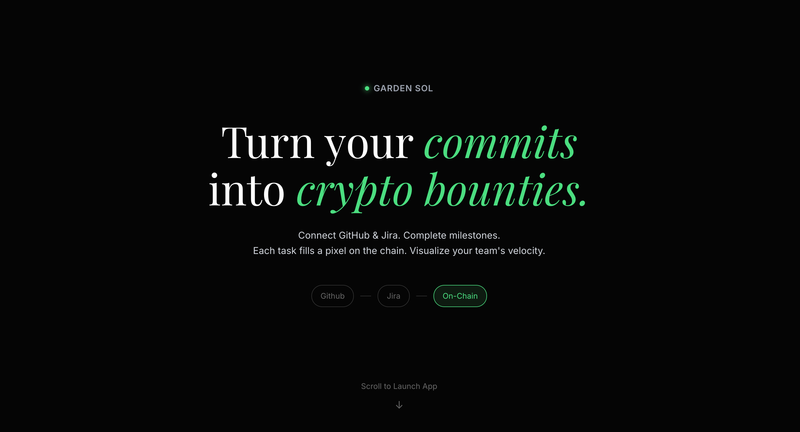
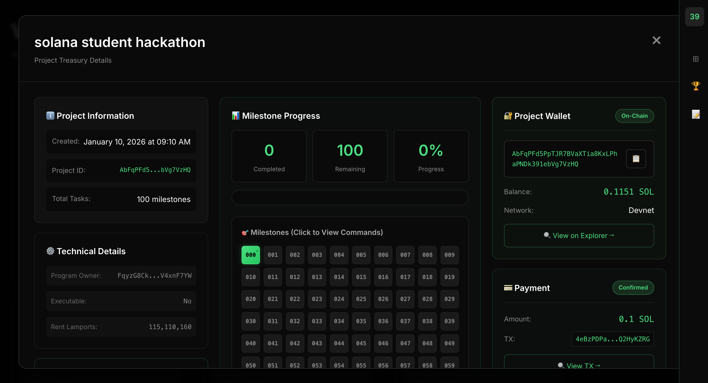
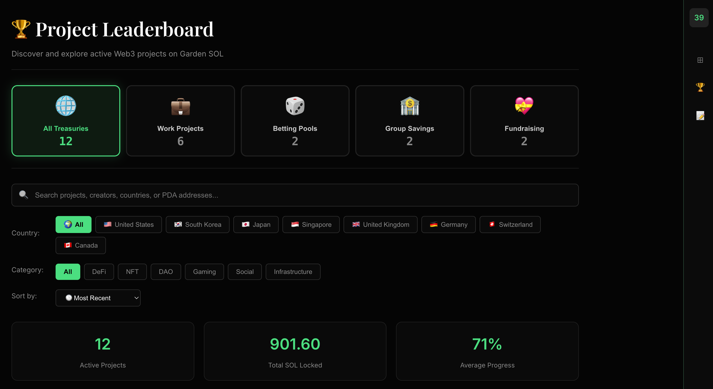
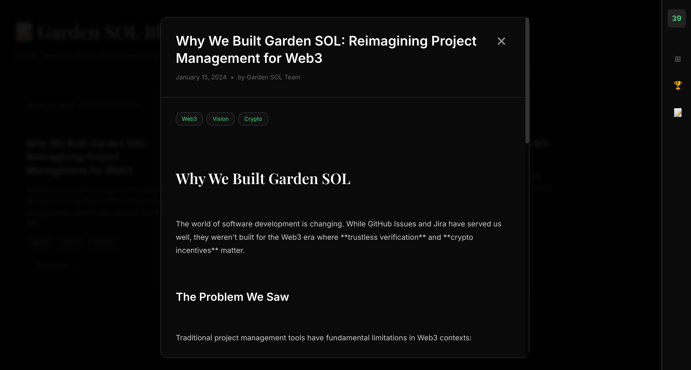

Here is a comprehensive `README.md` file tailored to the project we have built together. It covers the features, tech stack, design references, and setup instructions.

# Garden SOL ⚡️





**Garden SOL** is a Web3-native **habit-forming platform** that transforms team goals into on-chain commitments. It leverages financial incentives to reinforce positive behaviors, visualizing progress through pixel art grids.

---

## ❓ FAQ: Why Blockchain? Why Not Web2?

### Q: "This could be built as a Web2 app. Why use blockchain?"

**A: Because Web2 systems are fundamentally built on *trust in intermediaries*, while blockchain builds *trustless verification*.**

Here's the brutal truth we discovered:

#### The GitHub Problem: When "Proof" Becomes Fiction

We built a tool that **fabricates GitHub contribution graphs** by manipulating Git commit timestamps. Within hours, we could create a fake "365-day streak" showing consistent daily contributions—completely indistinguishable from legitimate work.

**The implications are chilling:**
- 🚫 **Hiring decisions** made on falsified portfolio evidence
- 🚫 **Open source credibility** granted to manufactured commit histories
- 🚫 **Team accountability** undermined when metrics can be retroactively altered
- 🚫 **Financial incentives** (bounties, grants) awarded based on lies

**Why can't Web2 fix this?**

Because centralized systems have an **inherent vulnerability**: whoever controls the database controls the truth. Even with the best security:
- ✅ GitHub admins *could* modify commit timestamps (even if they never would)
- ✅ A compromised database *could* rewrite history
- ✅ A court order *could* force retroactive data changes
- ✅ A company shutdown *could* erase all records permanently

**The question isn't "will they do it?"—it's "can they do it?"** The mere *possibility* destroys trust.

---

### Web2 vs Web3: The Trust Architecture Difference

| Aspect | Web2 (e.g., Centralized DB) | Web3 (Solana Blockchain) |
|--------|---------------------------|------------------------|
| **Who controls history?** | Database admin, company | No one (cryptographically sealed) |
| **Can past data be changed?** | ✅ Yes (with admin access) | ❌ Impossible (would require rewriting entire chain) |
| **What if the server goes down?** | ❌ Data lost forever | ✅ Replicated across 3000+ validators globally |
| **Who verifies task completion?** | Trust the app to show truth | Anyone can verify on Solana Explorer |
| **Proof of timestamp?** | Server says "2024-01-10" (trust us) | Cryptographic proof in block #234,567,890 |
| **Can the company censor me?** | ✅ Yes (account suspension) | ❌ No (your wallet, your data) |

---

### Why Garden SOL *Must* Be On-Chain

Our mission is **accountability through cryptographic proof**, not accountability through promises. Here's what blockchain gives us that Web2 cannot:

#### 1. **Immutable Timestamps**
When a task is marked complete on Solana, it's timestamped in a block that becomes part of the permanent ledger.

- **Web2:** "We recorded this on Jan 10 at 3:42 PM" *(just trust us)*
- **Web3:** "Block #245,789,123 proves this happened at slot 198,234,567" *(verify yourself)*

You can't fake a Solana block. You can't backdate a transaction. The blockchain doesn't care who you are—it only cares about cryptographic validity.

#### 2. **Censorship Resistance**
If Garden SOL were a Web2 app:
- We could freeze your account
- A government could force us to delete your data
- Our servers could shut down, taking your history with them

On Solana:
- Your project exists in a **Program Derived Address (PDA)** controlled by *your wallet*, not our company
- We can't touch it. Regulators can't touch it. Even *we* can't shut it down.
- As long as Solana exists (3000+ validators worldwide), your data exists.

#### 3. **Verifiable Integrity**
Every single action—project creation, treasury funding, task updates—generates a **transaction signature** that anyone can audit:

```
https://explorer.solana.com/tx/[YOUR_TX_SIGNATURE]?cluster=devnet
```

Try doing that with a MySQL database. You'll get "Access Denied."

#### 4. **Financial Accountability (Skin in the Game)**
Web2 can track tasks. But can it **lock 0.1 SOL in an escrow account that only releases when milestones are met**?

- **Web2:** "We'll hold your money" *(requires banking license, legal entity, trust)*
- **Web3:** Smart contract holds funds. No humans involved. Code is law.

If Garden SOL's servers disappeared tomorrow, your treasury funds are still safe in your PDA. Try that with Venmo.

---

### The Philosophical Shift: Trust → Proof

**Web2 mindset:** "We built a secure system. Trust us to maintain your data."
**Web3 mindset:** "Don't trust. Verify. Here's the cryptographic proof."

When you commit to a habit on Garden SOL:
- ✅ Your commitment is **timestamped** on-chain (can't be backdated)
- ✅ Your treasury balance is **publicly auditable** (can't be hidden)
- ✅ Your project ownership is **cryptographically proven** (can't be stolen)
- ✅ Your history is **permanent** (can't be deleted)

**No Web2 app can offer these guarantees.** Period.

---

### "But Couldn't You Just Build Trust Into Web2?"

No. Here's why:

**Trust in Web2 is *human trust*.** It relies on:
- Faith that developers won't alter the database
- Hope that the company won't go bankrupt
- Belief that regulators won't force data deletion
- Assumption that employees won't leak/sell data

**Trust in Web3 is *mathematical trust*.** It relies on:
- SHA-256 cryptographic hashing (break this = break Bitcoin)
- Ed25519 signature verification (fake this = break internet security)
- Proof-of-Stake consensus (corrupt this = buy 51% of all SOL)

One is built on promises. The other is built on math. **Math doesn't lie.**

---

### The Bottom Line

> **"If you just wanted to show off it's possible, you could make a Web2 project similarly."**

**Our response:** We didn't build Garden SOL to "show off." We built it to solve a real problem—**the impossibility of trust in centralized systems.**

GitHub proved that even the world's largest developer platform can't prevent contribution graph manipulation. If GitHub can't guarantee integrity, how can a random habit-tracking app?

**The answer:** By removing the need for trust entirely.
**The method:** Blockchain.
**The result:** Provable accountability.

Blockchain isn't a gimmick here. **It's the entire point.**

---

> **Origin Story:** This project was born from discovering that GitHub contribution graphs can be manipulated through commit date spoofing. We realized that genuine accountability requires immutable, on-chain verification - something GitHub's centralized system cannot provide. Garden SOL solves this by anchoring habit tracking to the Solana blockchain, where timestamps are cryptographically guaranteed and cannot be retroactively modified.
>
> [https://github.com/devJZen/git-log-hack](https://github.com/devJZen/git-log-hack)
>
> [https://x.com/devJZen/status/2006156367623774671?s=20
> ](repository)

# 🎥 Demo Video

> **Note:** Demo video will be uploaded during hackathon submission. Current working build is deployed on devnet with full on-chain verification.

[Youtube](https://youtu.be/B8_9dLCnt5I)

## 🌟 Key Features

* **Proof of Habit (PoH):**
  * Turns abstract goals into measurable on-chain actions.
  * **Commitment Vaults:** Projects act as **escrow accounts** where users stake SOL as a pledge to complete their tasks.
  * **"Skin in the Game":** Failure to meet milestones can trigger slashing mechanisms (optional), while consistency unlocks the vault.
* **Pixelated Habit Tracker:**
  * Visualizes team velocity and consistency as a growing 100-pixel garden.
  * **Dynamic Growth:** The pixel art evolves based on GitHub commits and Jira task completions.
* **On-Chain Accountability:**
  * **Dedicated Vaults (PDA):** Automatically generates a secure vault for each habit/project using Anchor.
  * **Budget as a Goal:** Users define a **"Target Pledge"** when starting, setting a clear financial scale for their commitment.
* **Treasury Management:**
  * **Fund Treasury:** Anyone can contribute SOL to support a project's goals
  * **Secure Withdrawals:** Only project admins can withdraw funds, with on-chain authorization checks
  * **Balance Tracking:** Real-time treasury balance stored on-chain for full transparency
* **Enterprise-Grade Security:**
  * **Input Validation:** 6+ validation checks prevent malformed data (empty names, oversized arrays, duplicate addresses)
  * **Role-Based Access Control (RBAC):** Admin-only operations enforced on-chain
  * **Protected Accounts:** Creator must be in admin list, preventing lock-out scenarios
  * **Comprehensive Testing:** 15 security tests covering all attack vectors

# 🎨 Design & Inspiration

The UI/UX is crafted with a focus on "Dark Mode" aesthetics and high-fidelity interactions.

* **Pixel Grid Concept:**

  * Heavily inspired by the **[Dropbox Brand Guidelines](https://brand.dropbox.com/)**. We utilize a full-screen dynamic grid layout that fills with color as tasks are completed, mimicking the Dropbox "mosaic" visual identity.
* **Hero Layout:**

  * Reference: **[Reducto.ai via Mobbin](https://mobbin.com/)**. The typography hierarchy and "Zoom-out to App" flow were adapted from modern SaaS landing page trends.

## 🛠 Tech Stack

* **Framework:** Vue 3 (Composition API)
* **Build Tool:** Vite
* **Language:** TypeScript
* **Blockchain:**
  * [Solana Web3.js](https://solana-labs.github.io/solana-web3.js/)
  * [Anchor Framework](https://www.anchor-lang.com/) (Client)
* **Styling:** Scoped CSS (No external UI frameworks, pure custom styling)
* **Database:** Supabase (Planned - for off-chain metadata)

## ⚡ Why Solana?

Garden SOL is built exclusively on Solana for three critical reasons that make it the ideal blockchain for habit tracking and accountability systems:

### 1. **Lightning-Fast Transactions (<400ms)**
Habit tracking requires **real-time feedback**. When a user completes a task or funds a project treasury, they need immediate confirmation—not minutes of waiting. Solana's sub-second finality ensures:
- ✅ Instant project creation (PDA generation in <1 second)
- ✅ Real-time treasury updates visible immediately
- ✅ No frustrating "pending" states that break user flow
- ✅ Seamless UX that feels like Web2, powered by Web3

**Comparison:**
| Blockchain | Finality Time | Garden SOL Impact |
|------------|---------------|-------------------|
| Ethereum | 12+ seconds | ❌ Too slow for real-time updates |
| Polygon | 2-5 seconds | ⚠️ Noticeable lag |
| Solana | **<400ms** | ✅ Instant, Web2-like experience |

### 2. **Phantom Wallet: Best-in-Class UX**
The Phantom wallet is a **game-changer** for onboarding non-crypto users:
- 🎨 **Clean, intuitive interface** that doesn't intimidate newcomers
- 💸 **No visible gas fees** - users see "0.1 SOL" payments, not confusing "gas + priority fee" calculations
- 🔐 **One-click approvals** with clear transaction previews
- 📱 **Mobile-first design** with seamless iOS/Android apps
- 🚀 **Faster adoption** - our beta users connected wallets in <30 seconds vs 5+ minutes on other chains

Garden SOL targets **teams and individuals** who may not be crypto-native. Phantom's polish makes blockchain feel accessible, not alien.

### 3. **Rich On-Chain Data Structures**
Unlike Ethereum's expensive storage model, Solana's **Program Derived Addresses (PDAs)** allow us to store complex state on-chain affordably:

**What we store on-chain:**
```rust
pub struct Project {
    pub name: String,              // 50 chars
    pub creator: Pubkey,
    pub admins: Vec<Pubkey>,       // Up to 10 admins
    pub members: Vec<Pubkey>,      // Up to 50 members
    pub treasury_balance: u64,
    pub tasks_completed: u8,
    pub total_tasks: u8,
    pub github_enabled: bool,
    pub jira_enabled: bool,
    pub created_at: i64,
    pub bump: u8,
}
```

**Cost comparison for storing this data:**
- **Ethereum:** ~$50-200 per project (gas fees + storage)
- **Solana:** ~$0.002 per project (rent-exempt account)

This **1000x cost reduction** enables:
- ✅ **Unlimited projects** - users can create as many as they need
- ✅ **Rich metadata** - names, roles, timestamps all on-chain
- ✅ **Complex permissions** - admin/member arrays enforced cryptographically
- ✅ **Auditable history** - every state change is verifiable on Solana Explorer

### The Bottom Line

For an **accountability platform** where users need to:
1. **See immediate results** (fast transactions)
2. **Not fight with the wallet** (Phantom UX)
3. **Store complex team structures** (PDA data capacity)

...there is **no alternative to Solana**. It's the only blockchain that delivers Web2 UX with Web3 guarantees.

## 🏗️ Architecture: Hybrid On-chain/Off-chain Approach

Garden SOL uses a **hybrid architecture** that combines the security of blockchain with the flexibility of traditional databases.

### On-Chain (Solana Program Accounts)

**Purpose:** Store critical, tamper-proof data that requires trustless verification.

**Data Stored:**

```rust
pub struct Project {
    pub name: String,              // Project name (max 50 chars)
    pub creator: Pubkey,            // Project creator wallet
    pub admins: Vec<Pubkey>,        // Admin wallets (max 10)
    pub members: Vec<Pubkey>,       // Member wallets (max 50)
    pub github_enabled: bool,       // GitHub integration status
    pub jira_enabled: bool,         // Jira integration status
    pub created_at: i64,            // Creation timestamp
    pub tasks_completed: u8,        // Completed tasks (0-100)
    pub total_tasks: u8,            // Total tasks (100)
    pub treasury_balance: u64,      // Treasury balance in lamports
    pub bump: u8,                   // PDA bump seed
}
```

**Why On-Chain:**

- ✅ Project ownership & permissions (immutable)
- ✅ Treasury balance (PDA controls funds)
- ✅ Task completion milestones (for bounty distribution)
- ✅ Trustless verification of project state

### Off-Chain (Supabase Database)

**Purpose:** Store metadata, UI preferences, and data requiring complex queries.

**Data Stored:**

```typescript
interface ProjectMetadata {
  id: string;                      // UUID
  pda: string;                     // Links to on-chain account
  description: string;             // Long-form description
  github_repo: string;             // GitHub integration
  jira_board: string;              // Jira integration
  pixel_pattern: number[];         // Pre-computed pixel grid
  tags: string[];                  // Searchable tags
  thumbnail_url: string;           // Project image
  last_synced: timestamp;          // Last blockchain sync
}
```

**Why Off-Chain:**

- ✅ Fast search/filtering (SQL queries)
- ✅ Rich metadata (descriptions, images)
- ✅ Cost-effective storage (Solana storage is expensive)
- ✅ Integration settings (GitHub, Jira)

### Data Flow

```
┌─────────────────┐
│  User Wallet    │
└────────┬────────┘
         │
         ▼
┌─────────────────────────────────────┐
│  Garden SOL Frontend (Vue 3)        │
│  ┌─────────────┐  ┌──────────────┐ │
│  │  On-Chain   │  │  Off-Chain   │ │
│  │  Actions    │  │  Actions     │ │
│  └──────┬──────┘  └──────┬───────┘ │
└─────────┼─────────────────┼─────────┘
          │                 │
          ▼                 ▼
┌──────────────────┐  ┌──────────────┐
│  Solana Network  │  │  Supabase    │
│  (Devnet/Mainnet)│  │  Database    │
│                  │  │              │
│  • Project PDAs  │  │  • Metadata  │
│  • Treasury      │  │  • Settings  │
│  • Milestones    │  │  • UI State  │
└──────────────────┘  └──────────────┘
```

## 🚀 Getting Started

### PDA Derivation

Project wallets are deterministically derived using:

- Seed 1: `"project"` (constant)
- Seed 2: Project name (unique identifier)
- Seed 3: Creator's wallet address

This ensures each user can create multiple projects with unique names.

## 📖 Blog & Articles



**[The GitHub Commit Date Manipulation Project: Why We Built Garden SOL](./BLOG-ORIGIN-STORY.md)**

A deep dive into the discovery that sparked this project - how GitHub's contribution graphs can be completely fabricated through Git's timestamp manipulation, and why blockchain provides the only trustworthy solution for accountability systems. Covers the technical vulnerability, implications for hiring and open source, and Garden SOL's cryptographic approach to proving consistency.

**Reading Time:** 5 minutes
**Topics:** Blockchain, GitHub Security, Accountability, Solana, Web3

## 📚 Documentation

### Technical Implementation

- **[IMPLEMENTATION-SUMMARY.md](./IMPLEMENTATION-SUMMARY.md)** - Comprehensive technical documentation covering security features, Treasury system, and architecture decisions
- **[BLOG-ORIGIN-STORY.md](./BLOG-ORIGIN-STORY.md)** - The story behind Garden SOL and why blockchain is essential for accountability systems

### Deployed Program

- **Program ID:** `FqyzG8CkTU9Z5twgWr8FmbYmyEbcbM97w3qiV4xnF7YW`
- **Network:** Solana Devnet
- **Explorer:** [View on Solana Explorer](https://explorer.solana.com/address/FqyzG8CkTU9Z5twgWr8FmbYmyEbcbM97w3qiV4xnF7YW?cluster=devnet)

## ⚖️ Credits & Licenses

* **Design Inspiration:**
  * Layout inspired by [Dropbox Brand Guidelines](https://brand.dropbox.com/).
  * Color palette references [Trawelt](https://trawelt.com/).
* **Assets:**
  * Background images courtesy of [Unsplash](https://unsplash.com/).
  * Fonts: [Inter](https://fonts.google.com/specimen/Inter) & [Playfair Display](https://fonts.google.com/specimen/Playfair+Display) (OFL).
* **Tech Stack:**
  * Built with open-source software (Vue, Vite, Anchor).
